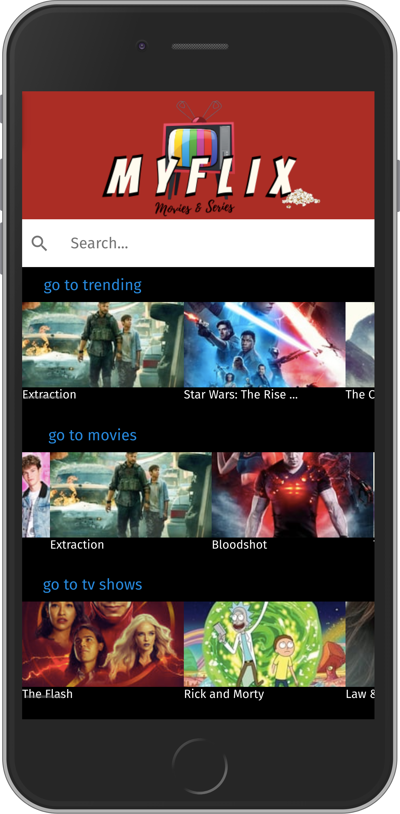
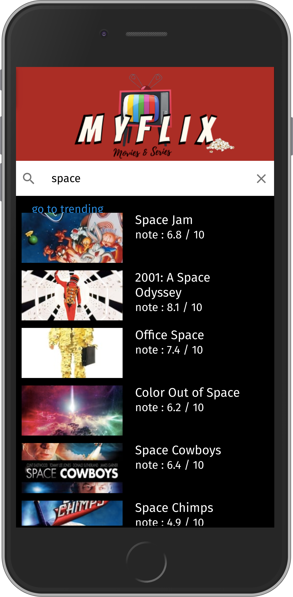
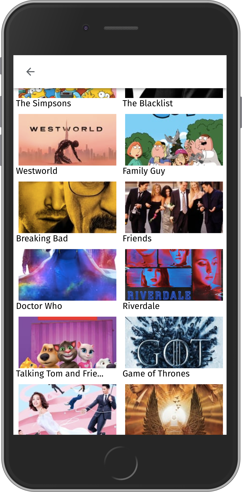
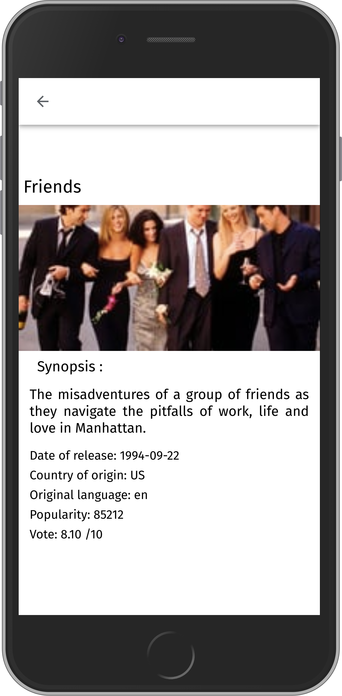

# react-native

## Screenshots

## Clone the project

git clone https://github.com/Damien1208/react-native.git
npm install

create a .env file
create this variable with your key 
API_KEY=< YOUR theMovieDB API KEY >

https://www.themoviedb.org/

You're good to go...
